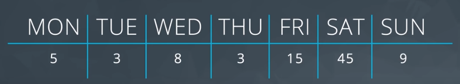

----------------- Business Analytics using data -------------------->
 
     ----------- Introduction to Business Analytics ---->

     ----------- Passed the first Project -------------->

         The first project was based on  finding insight from data that 
         I have to interact with and more importantly, explain those insight 
         to others for better understanding.

----------- Introduction to data ----------------------------------->

     - Mesure of center such as Mean, Median, Mode
     - Left Skewed
     - Right Skewed
     - handling Outliers

     This second part part will be based on:
        Descriptive Statistics - Part I
        Descriptive Statistics - Part II
        Spreadsheets 1: Getting Started
        Spreadsheets 2: Manipulate Data
        Spreadsheets 3: Analyze Data
        Spreadsheets 4: Visualize Data
        Business Metrics
        Excel Modeling

     As shown in the image below, the first 2 lessons are on Descriptive Statistics, 
     followed by 4 lessons on Spreadsheets. All of these lessons serve as a foundation 
     to topics on business analysis, in particular, Business Metrics covered in Lesson 7 
     and Excel Modeling covered in Lesson 8.

    Lesson Overview
    In this lesson, we will cover some of the foundational statistical topics needed to 
    use statistics in practice. You will learn how to:
    
    Evaluate data types and variable types
    Analyze measures of center
    Implement notation

    Course Prerequisites
    This course does not have any hard prerequisites, although having some knowledge of the 
    following areas may be useful:
    
    Basic Math (addition, subtraction, multiplication, division)
    Basic spreadsheet usage (such as entering data in cells) - although we will also start at 
    a basic level later in the course Use Cases

   
    Descriptive Statistics is useful in many different jobs, and activities. Having a good understanding 
    of descriptive statistics will help anyone working in:

    Business Analytics
    Data Analysis
    Data Engineering
    Product Management
    and so much more. Once you are finished with this course and its concepts, you'll be able to apply 
    them in ways you didn't even think about before.

----------- Type of Data --------------------------------------->

    Data Types
    - In this video, two data types are introduced: Quantitative and Categorical.
    - Quantitative data takes on numeric values that allow us to perform mathematical operations 
      (like the number of dogs). Addition, soustraction etc...
    - Categorical is used to label a group or set of items (like dog breeds - Collies, Labs, Poodles, etc.).

    - The Categorical data can be divided into two parts:
        - Ordinal(ordered) such as Rating -> Very positive, positive, neutral, negative etc...
        - Normal(No order) such as Breed -> Lab, poodle, pug, chihuahua etc..

    - The Quantitive data can also be divided into two parts:
        - Continuous
             data can be split into smaller and smaller units, and still a smaller unit exists. 
             An example of this is the age of the dog - we can measure the units of the age in years, 
             months, days, hours, seconds, but there are still smaller units that could be associated 
             with the age. This can includ negative, and decimal values.
        - Discrete
            data only takes on countable values. The number of dogs we interact with is an example of a 
            discrete data type. This only take a countable values like 5 dogs and can't be split.

 
--------------- Summary --------------------------------->

------------------------- Measures of center -------------->
     

- mean or average is the best measure of center

      The measures of center among the options you provided are:
        Mean
        Median
        Mode
        The mean represents the average value of a dataset, the median is the 
        middle value when the data is sorted, and the mode is the most frequently occurring value.
        These measures provide information about the central tendency of the data.
        The other options you provided are not measures of center:
        
        Standard Deviation and 3) Variance are measures of dispersion that describe the spread or variability of the data.
        Inter-quartile range (IQR) is a measure of spread, specifically the range between the first quartile and the third quartile.
        Range refers to the difference between the maximum and minimum values in a dataset.
        Maximum represents the highest value in the dataset.
        Minimum represents the lowest value in the dataset.
        Therefore, the measures of center are the mean, median, and mode.

  - Median or the middle value 

        The median splits our data so that 50% of our values are lower and 50% are higher. 
        We found in this video that how we calculate the median depends on if we have an 
        even number of observations or an odd number of observations.

        Median for Odd Values
        If we have an odd number of observations, the median is simply the number in the direct middle. 
        For example, if we have 7 observations, the median is the fourth value when our numbers are ordered from 
        smallest to largest.
        If we have 9 observations, the median is the fifth value.

        Median for Even Values
        If we have an even number of observations, the median is the average of the two values in the middle.
        For example, if we have 8 observations, we average the fourth and fifth values together when our numbers are 
        ordered from smallest to largest.

        In order to compute the median, we MUST sort our values first.

        Whether we use the mean or median to describe a dataset is largely dependent on the shape of our dataset 
        and if there are any outliers. We will talk about this in just a bit!

- Mode or most frequent value

      The mode is the most frequently observed value in our dataset.
      There might be multiple modes for a particular dataset or no mode at all.

      No Mode
      If all observations in our dataset are observed with the same frequency, there is no mode. 
      If we have the dataset:
      1, 1, 2, 2, 3, 3, 4, 4
      There is no mode because all observations occur the same number of times.
      Many Modes
      If two (or more) numbers share the maximum value, then there is more than one mode. If we have the dataset:
      1, 2, 3, 3, 3, 4, 5, 6, 6, 6, 7, 8, 9
      There are two modes 3 and 6, because these values share the maximum frequencies at 3 times, while all other 
      values only appear once.

      

